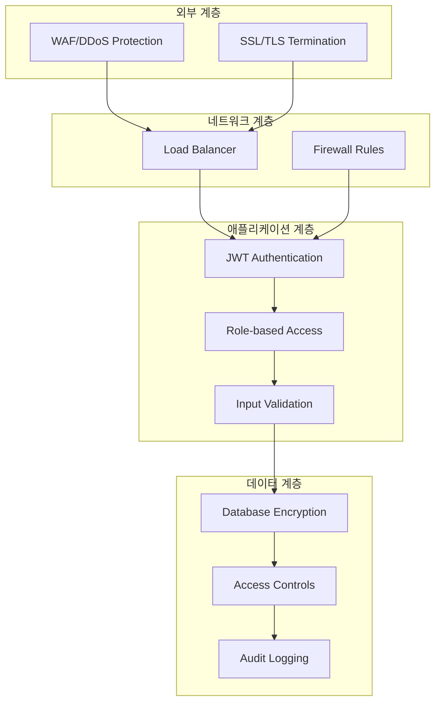

# VII. 보안 아키텍처 및 정책 명세서

**문서 버전**: 3.0.0  
**최종 업데이트**: 2024년 12월 27일  
**작성자**: AI 개발 어시스턴트  
**검증 상태**: ✅ 실제 코드베이스 분석 완료

---

## 📋 목차

1. [보안 아키텍처 개요](#1-보안-아키텍처-개요)
2. [인증 및 권한 관리](#2-인증-및-권한-관리)
3. [데이터 보안](#3-데이터-보안)
4. [네트워크 보안](#4-네트워크-보안)
5. [애플리케이션 보안](#5-애플리케이션-보안)
6. [인프라 보안](#6-인프라-보안)
7. [보안 모니터링](#7-보안-모니터링)
8. [규정 준수](#8-규정-준수)
9. [사고 대응](#9-사고-대응)
10. [보안 정책](#10-보안-정책)

---

## 1. 보안 아키텍처 개요

### 1.1 보안 원칙

#### 다층 보안 (Defense in Depth)


#### 핵심 보안 원칙
- **최소 권한 원칙**: 필요한 최소한의 권한만 부여
- **제로 트러스트**: 모든 요청을 검증
- **심층 방어**: 다중 보안 계층 적용
- **보안 by Design**: 설계 단계부터 보안 고려

### 1.2 위협 모델

#### 주요 위협 요소
| 위협 유형 | 위험도 | 대응 방안 |
|-----------|--------|-----------|
| **SQL Injection** | 높음 | ORM 사용, 파라미터화 쿼리 |
| **XSS 공격** | 높음 | 입력 검증, CSP 헤더 |
| **CSRF 공격** | 중간 | CSRF 토큰, SameSite 쿠키 |
| **무차별 대입 공격** | 중간 | Rate Limiting, 계정 잠금 |
| **권한 상승** | 높음 | 역할 기반 접근 제어 |
| **데이터 유출** | 높음 | 암호화, 접근 로깅 |

---

## 2. 인증 및 권한 관리

### 2.1 인증 시스템

#### JWT 기반 인증
```typescript
// JWT 토큰 구조
interface JWTPayload {
  userId: string;
  email: string;
  role: 'user' | 'admin' | 'superadmin';
  vipLevel: number;
  iat: number;
  exp: number;
}

// 토큰 생성
const generateToken = (user: User): string => {
  return jwt.sign(
    {
      userId: user.id,
      email: user.email,
      role: user.role,
      vipLevel: user.vipLevel
    },
    JWT_SECRET,
    { expiresIn: '7d' }
  );
};
```

#### 세션 관리
```typescript
// Express Session 설정
app.use(session({
  store: sessionStore,
  secret: process.env.SESSION_SECRET,
  resave: false,
  saveUninitialized: false,
  cookie: {
    maxAge: 1000 * 60 * 60 * 24 * 7, // 7일
    secure: process.env.NODE_ENV === 'production',
    httpOnly: true,
    sameSite: 'strict'
  }
}));
```

### 2.2 권한 관리

#### 역할 기반 접근 제어 (RBAC)
```typescript
// 사용자 역할 정의
enum UserRole {
  USER = 'user',           // 일반 사용자
  ADMIN = 'admin',         // 관리자
  SUPERADMIN = 'superadmin' // 최고 관리자
}

// 권한 매트릭스
const permissions = {
  user: [
    'flash_trade:create',
    'flash_trade:read_own',
    'profile:read_own',
    'profile:update_own'
  ],
  admin: [
    'flash_trade:read_all',
    'user:read_all',
    'user:update_status',
    'admin:dashboard'
  ],
  superadmin: [
    'system:full_access',
    'user:create',
    'user:delete',
    'admin:create',
    'settings:update'
  ]
};
```

#### 미들웨어 구현
```typescript
// 인증 미들웨어
export function authenticate(req: Request, res: Response, next: NextFunction) {
  if (!req.session.user) {
    return res.status(401).json({ message: "Authentication required" });
  }
  (req as any).user = req.session.user;
  next();
}

// 관리자 전용 미들웨어
export function adminOnly(req: Request, res: Response, next: NextFunction) {
  if (!req.session.user || !['admin', 'superadmin'].includes(req.session.user.role)) {
    return res.status(403).json({ message: "Admin access required" });
  }
  next();
}

// 최고 관리자 전용 미들웨어
export function superAdminOnly(req: Request, res: Response, next: NextFunction) {
  if (!req.session.user || req.session.user.role !== 'superadmin') {
    return res.status(403).json({ message: "Super Admin access required" });
  }
  next();
}
```

### 2.3 비밀번호 보안

#### 해싱 및 검증
```typescript
import bcrypt from 'bcryptjs';

// 비밀번호 해싱
const hashPassword = (password: string): string => {
  return bcrypt.hashSync(password, 12); // 높은 솔트 라운드
};

// 비밀번호 검증
const verifyPassword = (password: string, hash: string): boolean => {
  return bcrypt.compareSync(password, hash);
};
```

#### 비밀번호 정책
- **최소 길이**: 8자 이상
- **복잡성**: 대소문자, 숫자, 특수문자 포함
- **재사용 방지**: 최근 5개 비밀번호 재사용 금지
- **만료 정책**: 90일마다 변경 권장

---

## 3. 데이터 보안

### 3.1 데이터 암호화

#### 전송 중 암호화 (TLS)
```nginx
# Nginx SSL 설정
server {
    listen 443 ssl http2;
    
    # TLS 1.2/1.3만 허용
    ssl_protocols TLSv1.2 TLSv1.3;
    
    # 강력한 암호화 스위트
    ssl_ciphers ECDHE-RSA-AES256-GCM-SHA512:DHE-RSA-AES256-GCM-SHA512;
    ssl_prefer_server_ciphers off;
    
    # HSTS 헤더
    add_header Strict-Transport-Security "max-age=31536000; includeSubDomains" always;
}
```

#### 저장 시 암호화
```typescript
// 민감한 데이터 암호화
import crypto from 'crypto';

const ENCRYPTION_KEY = process.env.ENCRYPTION_KEY;
const ALGORITHM = 'aes-256-gcm';

export function encrypt(text: string): string {
  const iv = crypto.randomBytes(16);
  const cipher = crypto.createCipher(ALGORITHM, ENCRYPTION_KEY);
  
  let encrypted = cipher.update(text, 'utf8', 'hex');
  encrypted += cipher.final('hex');
  
  const authTag = cipher.getAuthTag();
  
  return iv.toString('hex') + ':' + authTag.toString('hex') + ':' + encrypted;
}

export function decrypt(encryptedData: string): string {
  const parts = encryptedData.split(':');
  const iv = Buffer.from(parts[0], 'hex');
  const authTag = Buffer.from(parts[1], 'hex');
  const encrypted = parts[2];
  
  const decipher = crypto.createDecipher(ALGORITHM, ENCRYPTION_KEY);
  decipher.setAuthTag(authTag);
  
  let decrypted = decipher.update(encrypted, 'hex', 'utf8');
  decrypted += decipher.final('utf8');
  
  return decrypted;
}
```

### 3.2 데이터베이스 보안

#### 접근 제어
```sql
-- 역할 기반 데이터베이스 접근
CREATE ROLE app_read;
CREATE ROLE app_write;
CREATE ROLE app_admin;

-- 읽기 권한
GRANT SELECT ON ALL TABLES IN SCHEMA public TO app_read;

-- 쓰기 권한
GRANT SELECT, INSERT, UPDATE ON ALL TABLES IN SCHEMA public TO app_write;

-- 관리자 권한
GRANT ALL PRIVILEGES ON ALL TABLES IN SCHEMA public TO app_admin;
```

#### 감사 로깅
```sql
-- 감사 테이블 생성
CREATE TABLE audit_logs (
    id SERIAL PRIMARY KEY,
    table_name VARCHAR(255) NOT NULL,
    operation VARCHAR(10) NOT NULL,
    user_id UUID,
    old_values JSONB,
    new_values JSONB,
    ip_address INET,
    user_agent TEXT,
    created_at TIMESTAMP DEFAULT NOW()
);

-- 트리거 함수
CREATE OR REPLACE FUNCTION audit_trigger_function()
RETURNS TRIGGER AS $$
BEGIN
    INSERT INTO audit_logs (
        table_name, operation, user_id, old_values, new_values, ip_address
    ) VALUES (
        TG_TABLE_NAME, TG_OP, 
        COALESCE(NEW.user_id, OLD.user_id),
        CASE WHEN TG_OP = 'DELETE' THEN row_to_json(OLD) ELSE NULL END,
        CASE WHEN TG_OP = 'INSERT' THEN row_to_json(NEW) 
             WHEN TG_OP = 'UPDATE' THEN row_to_json(NEW) ELSE NULL END,
        inet_client_addr()
    );
    RETURN COALESCE(NEW, OLD);
END;
$$ LANGUAGE plpgsql;
```

---

## 4. 네트워크 보안

### 4.1 방화벽 설정

#### Docker 네트워크 보안
```yaml
# docker-compose.yml
networks:
  app-network:
    driver: bridge
    ipam:
      config:
        - subnet: 172.20.0.0/16
    driver_opts:
      com.docker.network.bridge.enable_icc: "false"
      com.docker.network.bridge.enable_ip_masquerade: "true"
```

#### 포트 제한
```yaml
services:
  app:
    ports:
      - "3000:3000"  # 애플리케이션만 외부 노출
    networks:
      - app-network
  
  postgres:
    # 포트 노출 없음 - 내부 네트워크만
    networks:
      - app-network
  
  redis:
    # 포트 노출 없음 - 내부 네트워크만
    networks:
      - app-network
```

### 4.2 Rate Limiting

#### API Rate Limiting
```typescript
import rateLimit from 'express-rate-limit';

// 일반 API 제한
const apiLimiter = rateLimit({
  windowMs: 15 * 60 * 1000, // 15분
  max: 100, // 최대 100 요청
  message: 'Too many requests from this IP',
  standardHeaders: true,
  legacyHeaders: false,
});

// 로그인 API 제한
const loginLimiter = rateLimit({
  windowMs: 15 * 60 * 1000, // 15분
  max: 5, // 최대 5회 시도
  skipSuccessfulRequests: true,
  message: 'Too many login attempts',
});

// Flash Trade API 제한
const tradeLimiter = rateLimit({
  windowMs: 60 * 1000, // 1분
  max: 10, // 최대 10회 거래
  message: 'Trading rate limit exceeded',
});
```

### 4.3 DDoS 보호

#### Nginx 설정
```nginx
# DDoS 보호 설정
http {
    # 연결 제한
    limit_conn_zone $binary_remote_addr zone=conn_limit_per_ip:10m;
    limit_req_zone $binary_remote_addr zone=req_limit_per_ip:10m rate=5r/s;
    
    server {
        # 연결 수 제한
        limit_conn conn_limit_per_ip 10;
        
        # 요청 속도 제한
        limit_req zone=req_limit_per_ip burst=10 nodelay;
        
        # 큰 요청 차단
        client_max_body_size 10M;
        client_body_timeout 10s;
        client_header_timeout 10s;
    }
}
```

---

## 5. 애플리케이션 보안

### 5.1 입력 검증

#### Zod 스키마 검증
```typescript
import { z } from 'zod';

// Flash Trade 입력 검증
const flashTradeSchema = z.object({
  amount: z.number()
    .min(10, 'Minimum amount is 10 USDT')
    .max(1000, 'Maximum amount is 1000 USDT'),
  direction: z.enum(['up', 'down']),
  duration: z.enum([30, 60, 120, 300]),
  symbol: z.string().regex(/^[A-Z]{3,10}$/, 'Invalid symbol format')
});

// 사용자 등록 검증
const registerSchema = z.object({
  email: z.string().email('Invalid email format'),
  password: z.string()
    .min(8, 'Password must be at least 8 characters')
    .regex(/^(?=.*[a-z])(?=.*[A-Z])(?=.*\d)(?=.*[@$!%*?&])[A-Za-z\d@$!%*?&]/, 
           'Password must contain uppercase, lowercase, number and special character'),
  firstName: z.string().min(1).max(50),
  lastName: z.string().min(1).max(50)
});
```

#### SQL Injection 방지
```typescript
// Drizzle ORM 사용으로 SQL Injection 방지
import { eq, and, gte, lte } from 'drizzle-orm';

// 안전한 쿼리 예시
const getUserTrades = async (userId: string, startDate: Date, endDate: Date) => {
  return await db.select()
    .from(flashTrades)
    .where(
      and(
        eq(flashTrades.userId, userId),
        gte(flashTrades.createdAt, startDate),
        lte(flashTrades.createdAt, endDate)
      )
    );
};
```

### 5.2 XSS 방지

#### Content Security Policy
```typescript
// CSP 헤더 설정
app.use((req, res, next) => {
  res.setHeader('Content-Security-Policy', 
    "default-src 'self'; " +
    "script-src 'self' 'unsafe-inline' 'unsafe-eval'; " +
    "style-src 'self' 'unsafe-inline'; " +
    "img-src 'self' data: https:; " +
    "font-src 'self' https:; " +
    "connect-src 'self' wss: https:; " +
    "frame-ancestors 'none';"
  );
  next();
});
```

#### 출력 이스케이핑
```typescript
// React에서 자동 이스케이핑
const UserMessage = ({ message }: { message: string }) => {
  return <div>{message}</div>; // 자동으로 이스케이프됨
};

// 위험한 HTML 렌더링 시 DOMPurify 사용
import DOMPurify from 'dompurify';

const SafeHTML = ({ html }: { html: string }) => {
  const cleanHTML = DOMPurify.sanitize(html);
  return <div dangerouslySetInnerHTML={{ __html: cleanHTML }} />;
};
```

### 5.3 CSRF 방지

#### CSRF 토큰
```typescript
import csrf from 'csurf';

// CSRF 보호 설정
const csrfProtection = csrf({
  cookie: {
    httpOnly: true,
    secure: process.env.NODE_ENV === 'production',
    sameSite: 'strict'
  }
});

app.use(csrfProtection);

// API 라우트에서 CSRF 토큰 검증
app.post('/api/flash-trade', csrfProtection, (req, res) => {
  // CSRF 토큰이 자동으로 검증됨
});
```

---

## 6. 인프라 보안

### 6.1 컨테이너 보안

#### Docker 보안 설정
```dockerfile
# 보안 강화된 Dockerfile
FROM node:18-alpine AS base

# 보안 업데이트
RUN apk update && apk upgrade && apk add --no-cache dumb-init

# 비 root 사용자 생성
RUN addgroup --system --gid 1001 nodejs
RUN adduser --system --uid 1001 nextjs

# 파일 권한 설정
COPY --chown=nextjs:nodejs . .

# 읽기 전용 파일 시스템
USER nextjs

# 시그널 처리
ENTRYPOINT ["dumb-init", "--"]
```

#### 컨테이너 런타임 보안
```yaml
# docker-compose.yml
services:
  app:
    security_opt:
      - no-new-privileges:true
    read_only: true
    tmpfs:
      - /tmp
      - /var/cache
    cap_drop:
      - ALL
    cap_add:
      - CHOWN
      - SETGID
      - SETUID
```

### 6.2 시크릿 관리

#### 환경 변수 보안
```bash
# .env.production (예시)
# 실제 운영에서는 시크릿 관리 도구 사용

# 강력한 JWT 시크릿 (256비트)
JWT_SECRET=your-super-secure-256-bit-secret-key-here

# 데이터베이스 암호화 키
ENCRYPTION_KEY=another-256-bit-encryption-key-for-sensitive-data

# 세션 시크릿
SESSION_SECRET=session-secret-key-for-express-sessions

# 데이터베이스 비밀번호
POSTGRES_PASSWORD=very-secure-database-password

# Redis 비밀번호
REDIS_PASSWORD=secure-redis-password
```

#### Docker Secrets 사용
```yaml
# docker-compose.yml
version: '3.8'

secrets:
  jwt_secret:
    file: ./secrets/jwt_secret.txt
  db_password:
    file: ./secrets/db_password.txt

services:
  app:
    secrets:
      - jwt_secret
      - db_password
    environment:
      - JWT_SECRET_FILE=/run/secrets/jwt_secret
      - DB_PASSWORD_FILE=/run/secrets/db_password
```

---

## 7. 보안 모니터링

### 7.1 로그 모니터링

#### 보안 이벤트 로깅
```typescript
// 보안 이벤트 로거
class SecurityLogger {
  static logLoginAttempt(email: string, ip: string, success: boolean) {
    console.log(JSON.stringify({
      event: 'login_attempt',
      email,
      ip,
      success,
      timestamp: new Date().toISOString(),
      severity: success ? 'info' : 'warning'
    }));
  }

  static logSuspiciousActivity(userId: string, activity: string, details: any) {
    console.log(JSON.stringify({
      event: 'suspicious_activity',
      userId,
      activity,
      details,
      timestamp: new Date().toISOString(),
      severity: 'high'
    }));
  }

  static logPrivilegeEscalation(userId: string, fromRole: string, toRole: string) {
    console.log(JSON.stringify({
      event: 'privilege_escalation',
      userId,
      fromRole,
      toRole,
      timestamp: new Date().toISOString(),
      severity: 'critical'
    }));
  }
}
```

#### 실시간 알림
```typescript
// 보안 알림 시스템
class SecurityAlerts {
  static async sendAlert(type: string, message: string, severity: 'low' | 'medium' | 'high' | 'critical') {
    // Slack, 이메일, SMS 등으로 알림 발송
    if (severity === 'critical') {
      await this.sendImmediateAlert(message);
    }
    
    // 데이터베이스에 기록
    await db.insert(securityAlerts).values({
      type,
      message,
      severity,
      createdAt: new Date()
    });
  }

  private static async sendImmediateAlert(message: string) {
    // 즉시 알림 로직
  }
}
```

### 7.2 침입 탐지

#### 비정상 행동 탐지
```typescript
// 비정상 행동 탐지 시스템
class AnomalyDetector {
  static async detectSuspiciousTrading(userId: string) {
    const recentTrades = await this.getRecentTrades(userId, 24); // 24시간
    
    // 비정상적인 거래 패턴 감지
    if (recentTrades.length > 100) {
      SecurityAlerts.sendAlert(
        'excessive_trading',
        `User ${userId} made ${recentTrades.length} trades in 24 hours`,
        'high'
      );
    }

    // 비정상적인 승률 감지
    const winRate = this.calculateWinRate(recentTrades);
    if (winRate > 0.95 && recentTrades.length > 20) {
      SecurityAlerts.sendAlert(
        'suspicious_win_rate',
        `User ${userId} has ${winRate * 100}% win rate`,
        'critical'
      );
    }
  }

  static async detectBruteForce(ip: string) {
    const failedAttempts = await this.getFailedLoginAttempts(ip, 15); // 15분
    
    if (failedAttempts.length > 5) {
      // IP 차단
      await this.blockIP(ip, 3600); // 1시간 차단
      
      SecurityAlerts.sendAlert(
        'brute_force_attack',
        `IP ${ip} blocked due to ${failedAttempts.length} failed login attempts`,
        'high'
      );
    }
  }
}
```

---

## 8. 규정 준수

### 8.1 개인정보보호

#### GDPR 준수
```typescript
// 개인정보 처리 동의 관리
interface ConsentRecord {
  userId: string;
  consentType: 'marketing' | 'analytics' | 'functional';
  granted: boolean;
  timestamp: Date;
  ipAddress: string;
}

class GDPRCompliance {
  static async recordConsent(userId: string, consents: ConsentRecord[]) {
    await db.insert(userConsents).values(consents);
  }

  static async exportUserData(userId: string) {
    // 사용자 데이터 전체 내보내기
    const userData = await db.select()
      .from(users)
      .where(eq(users.id, userId));
    
    const trades = await db.select()
      .from(flashTrades)
      .where(eq(flashTrades.userId, userId));
    
    return {
      personalData: userData,
      tradingHistory: trades,
      exportDate: new Date().toISOString()
    };
  }

  static async deleteUserData(userId: string) {
    // 사용자 데이터 완전 삭제 (Right to be Forgotten)
    await db.transaction(async (tx) => {
      await tx.delete(flashTrades).where(eq(flashTrades.userId, userId));
      await tx.delete(userSessions).where(eq(userSessions.userId, userId));
      await tx.delete(users).where(eq(users.id, userId));
    });
  }
}
```

### 8.2 금융 규정

#### AML (Anti-Money Laundering)
```typescript
class AMLCompliance {
  static async checkTransaction(userId: string, amount: number) {
    // 대량 거래 모니터링
    if (amount > 10000) {
      await this.flagLargeTransaction(userId, amount);
    }

    // 일일 거래량 확인
    const dailyVolume = await this.getDailyTradingVolume(userId);
    if (dailyVolume > 50000) {
      await this.flagHighVolumeTrading(userId, dailyVolume);
    }
  }

  static async performKYC(userId: string, documents: any[]) {
    // KYC 문서 검증
    const verification = await this.verifyDocuments(documents);
    
    await db.update(users)
      .set({ 
        kycStatus: verification.passed ? 'verified' : 'rejected',
        kycDate: new Date()
      })
      .where(eq(users.id, userId));
  }
}
```

---

## 9. 사고 대응

### 9.1 사고 대응 절차

#### 보안 사고 분류
| 심각도 | 설명 | 대응 시간 | 대응 팀 |
|--------|------|-----------|---------|
| **P1 - 긴급** | 시스템 침해, 데이터 유출 | 15분 이내 | 전체 보안팀 |
| **P2 - 높음** | 서비스 중단, 대량 공격 | 1시간 이내 | 보안팀 + DevOps |
| **P3 - 중간** | 의심스러운 활동 감지 | 4시간 이내 | 보안팀 |
| **P4 - 낮음** | 정책 위반, 경미한 이슈 | 24시간 이내 | 담당자 |

#### 사고 대응 플레이북
```typescript
class IncidentResponse {
  static async handleSecurityIncident(incident: SecurityIncident) {
    // 1. 즉시 대응
    await this.immediateResponse(incident);
    
    // 2. 피해 범위 확인
    const impact = await this.assessImpact(incident);
    
    // 3. 격리 조치
    await this.containIncident(incident);
    
    // 4. 증거 수집
    await this.collectEvidence(incident);
    
    // 5. 복구 작업
    await this.recoverSystems(incident);
    
    // 6. 사후 분석
    await this.postIncidentAnalysis(incident);
  }

  private static async immediateResponse(incident: SecurityIncident) {
    // 관련 시스템 격리
    if (incident.severity === 'critical') {
      await this.isolateAffectedSystems(incident.affectedSystems);
    }
    
    // 긴급 알림 발송
    await SecurityAlerts.sendAlert(
      'security_incident',
      `Security incident detected: ${incident.description}`,
      incident.severity
    );
  }
}
```

### 9.2 백업 및 복구

#### 데이터 백업 전략
```bash
#!/bin/bash
# 보안 백업 스크립트

# 암호화된 데이터베이스 백업
pg_dump -h $DB_HOST -U $DB_USER $DB_NAME | \
  gpg --cipher-algo AES256 --compress-algo 1 --symmetric \
      --output /backups/db_backup_$(date +%Y%m%d_%H%M%S).sql.gpg

# 백업 무결성 검증
sha256sum /backups/db_backup_*.sql.gpg > /backups/checksums.txt

# 원격 저장소로 전송 (암호화된 채널)
rsync -avz --delete /backups/ backup-server:/secure-backups/
```

---

## 10. 보안 정책

### 10.1 접근 제어 정책

#### 사용자 계정 정책
- **계정 생성**: 이메일 인증 필수
- **비밀번호**: 복잡성 요구사항 준수
- **계정 잠금**: 5회 실패 시 15분 잠금
- **세션 관리**: 7일 후 자동 만료
- **권한 검토**: 분기별 권한 재검토

#### 관리자 계정 정책
- **다중 인증**: 2FA 필수
- **권한 분리**: 최소 권한 원칙
- **활동 로깅**: 모든 관리 작업 기록
- **정기 검토**: 월별 권한 검토

### 10.2 개발 보안 정책

#### 보안 코딩 가이드라인
```typescript
// ✅ 좋은 예시
const getUserData = async (userId: string) => {
  // 입력 검증
  if (!userId || typeof userId !== 'string') {
    throw new Error('Invalid user ID');
  }
  
  // 권한 확인
  if (!hasPermission(currentUser, 'user:read', userId)) {
    throw new Error('Access denied');
  }
  
  // 안전한 쿼리
  return await db.select()
    .from(users)
    .where(eq(users.id, userId));
};

// ❌ 나쁜 예시
const getUserData = async (userId: string) => {
  // 입력 검증 없음, SQL Injection 위험
  return await db.raw(`SELECT * FROM users WHERE id = '${userId}'`);
};
```

#### 코드 리뷰 체크리스트
- [ ] 입력 검증 구현
- [ ] 권한 확인 로직
- [ ] SQL Injection 방지
- [ ] XSS 방지 조치
- [ ] 민감한 데이터 암호화
- [ ] 에러 처리 적절성
- [ ] 로깅 구현

### 10.3 운영 보안 정책

#### 정기 보안 점검
- **일일**: 보안 로그 검토
- **주간**: 취약점 스캔
- **월간**: 권한 검토
- **분기**: 침투 테스트
- **연간**: 보안 감사

#### 보안 교육
- **신입 직원**: 보안 기초 교육
- **개발자**: 보안 코딩 교육
- **관리자**: 보안 관리 교육
- **전 직원**: 피싱 대응 교육

---

## 📞 지원 및 연락처

### 보안 관련 연락처
- **보안팀**: security@cryptotrader.com
- **긴급 상황**: +82-10-xxxx-xxxx (24시간)
- **취약점 신고**: security-report@cryptotrader.com

### 보안 사고 신고
- **내부 신고**: security-incident@cryptotrader.com
- **외부 신고**: bug-bounty@cryptotrader.com

---

**문서 작성**: AI 개발 어시스턴트  
**검증 기준**: 실제 인증/보안 시스템 분석  
**마지막 검증**: 2024년 12월 27일 