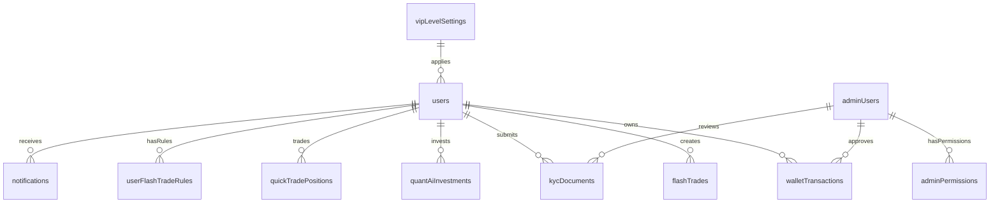

# V. 데이터베이스 설계 상세 명세 (최종 통합 버전)

**최종 업데이트**: 2024년 12월 27일  
**기반**: 실제 스키마 파일 (shared/schema.ts 15KB, 300줄)

---

## 🗄️ 데이터베이스 개요

### 기술 스택
- **DBMS**: PostgreSQL 15+ (Supabase)
- **ORM**: Drizzle ORM 0.39.1
- **스키마 관리**: 타입 안전 스키마 정의
- **마이그레이션**: supabase/migrations/

---

## 📊 전체 ERD 구조



---

## 🏗️ 핵심 테이블 구조

### 1. users (사용자 테이블)
```sql
CREATE TABLE users (
    id                      UUID PRIMARY KEY DEFAULT gen_random_uuid(),
    email                   VARCHAR(255) UNIQUE NOT NULL,
    firstName               VARCHAR(100) NOT NULL,
    lastName                VARCHAR(100) NOT NULL,
    nickname                VARCHAR(100),
    password                VARCHAR(255) NOT NULL,
    role                    VARCHAR(20) DEFAULT 'user' NOT NULL,
    balance                 DECIMAL(15,2) DEFAULT '10000.00',
    vipLevel                INTEGER DEFAULT 1,
    assignedAdminId         UUID,
    withdrawalPasswordHash  VARCHAR(255),
    lastLoginIp             VARCHAR(45),
    lastLoginAt             TIMESTAMP WITH TIME ZONE,
    restrictedTradeTypes    JSONB,
    isActive                BOOLEAN DEFAULT true,
    createdAt               TIMESTAMP WITH TIME ZONE DEFAULT NOW(),
    updatedAt               TIMESTAMP WITH TIME ZONE DEFAULT NOW()
);
```

### 2. flashTrades (Flash Trade 거래)
```sql
CREATE TABLE flashTrades (
    id            UUID PRIMARY KEY DEFAULT gen_random_uuid(),
    userId        UUID REFERENCES users(id) ON DELETE CASCADE NOT NULL,
    amount        DECIMAL(15,2) NOT NULL,
    direction     VARCHAR(10) NOT NULL, -- 'up', 'down'
    duration      INTEGER NOT NULL,     -- 초 단위
    startPrice    DECIMAL(15,8) NOT NULL,
    endPrice      DECIMAL(15,8),
    result        VARCHAR(10),          -- 'win', 'lose'
    profit        DECIMAL(15,2),
    status        VARCHAR(20) DEFAULT 'active', -- 'active', 'completed', 'cancelled'
    adminOverride BOOLEAN DEFAULT false,
    createdAt     TIMESTAMP WITH TIME ZONE DEFAULT NOW(),
    expiresAt     TIMESTAMP WITH TIME ZONE NOT NULL
);
```

### 3. adminUsers (관리자 사용자)
```sql
CREATE TABLE adminUsers (
    id             UUID PRIMARY KEY DEFAULT gen_random_uuid(),
    email          VARCHAR(255) UNIQUE NOT NULL,
    hashedPassword VARCHAR(255) NOT NULL,
    name           VARCHAR(100) NOT NULL,
    role           VARCHAR(20) DEFAULT 'admin' NOT NULL, -- 'superadmin', 'admin'
    isActive       BOOLEAN DEFAULT true,
    createdAt      TIMESTAMP WITH TIME ZONE DEFAULT NOW(),
    updatedAt      TIMESTAMP WITH TIME ZONE DEFAULT NOW()
);
```

### 4. userFlashTradeRules (거래 규칙)
```sql
CREATE TABLE userFlashTradeRules (
    id                UUID PRIMARY KEY DEFAULT gen_random_uuid(),
    userId            UUID REFERENCES users(id) ON DELETE CASCADE NOT NULL,
    mode              VARCHAR(20) NOT NULL, -- 'force_win', 'force_lose', 'random'
    winRate           DECIMAL(5,2),         -- 랜덤 모드일 때 승률
    validFrom         TIMESTAMP WITH TIME ZONE,
    validUntil        TIMESTAMP WITH TIME ZONE,
    minAmountFilter   DECIMAL(15,2),
    maxAmountFilter   DECIMAL(15,2),
    isActive          BOOLEAN DEFAULT true,
    createdAt         TIMESTAMP WITH TIME ZONE DEFAULT NOW(),
    updatedAt         TIMESTAMP WITH TIME ZONE DEFAULT NOW()
);
```

---

## 💰 지갑 및 거래 테이블

### walletTransactions (지갑 거래)
```sql
CREATE TABLE walletTransactions (
    id                   UUID PRIMARY KEY DEFAULT gen_random_uuid(),
    userId               UUID REFERENCES users(id) ON DELETE CASCADE NOT NULL,
    type                 VARCHAR(20) NOT NULL, -- 'deposit', 'withdrawal', 'bonus', 'trade'
    coin                 VARCHAR(10) NOT NULL,
    network              VARCHAR(20),
    amount               DECIMAL(20,8) NOT NULL,
    address              VARCHAR(255),
    txHash               VARCHAR(255),
    screenshotUrl        VARCHAR(500),
    bonusAppliedAmount   DECIMAL(15,2),
    adminApproverId      UUID REFERENCES adminUsers(id),
    rejectionReason      TEXT,
    status               VARCHAR(20) DEFAULT 'pending', -- 'pending', 'approved', 'rejected'
    createdAt            TIMESTAMP WITH TIME ZONE DEFAULT NOW(),
    processedAt          TIMESTAMP WITH TIME ZONE
);
```

### kycDocuments (KYC 문서)
```sql
CREATE TABLE kycDocuments (
    id                  UUID PRIMARY KEY DEFAULT gen_random_uuid(),
    userId              UUID REFERENCES users(id) ON DELETE CASCADE NOT NULL,
    documentType        VARCHAR(50) NOT NULL, -- 'id_front', 'id_back', 'selfie', 'address_proof'
    documentUrl         VARCHAR(500) NOT NULL,
    verificationLevel   INTEGER NOT NULL,     -- 1, 2
    status              VARCHAR(20) DEFAULT 'pending', -- 'pending', 'approved', 'rejected'
    adminReviewerId     UUID REFERENCES adminUsers(id),
    rejectionReason     TEXT,
    createdAt           TIMESTAMP WITH TIME ZONE DEFAULT NOW(),
    reviewedAt          TIMESTAMP WITH TIME ZONE
);
```

---

## 🤖 AI 투자 및 Quick Trade

### quantAiInvestments (퀀트 AI 투자)
```sql
CREATE TABLE quantAiInvestments (
    id                UUID PRIMARY KEY DEFAULT gen_random_uuid(),
    userId            UUID REFERENCES users(id) ON DELETE CASCADE NOT NULL,
    strategyName      VARCHAR(100) NOT NULL,
    investmentAmount  DECIMAL(15,2) NOT NULL,
    investmentPeriod  INTEGER NOT NULL,        -- 일 단위
    dailyReturnRate   DECIMAL(5,4) NOT NULL,
    currentValue      DECIMAL(15,2) NOT NULL,
    totalReturn       DECIMAL(15,2) DEFAULT '0',
    status            VARCHAR(20) DEFAULT 'active', -- 'active', 'completed', 'cancelled'
    autoReinvest      BOOLEAN DEFAULT false,
    createdAt         TIMESTAMP WITH TIME ZONE DEFAULT NOW(),
    completedAt       TIMESTAMP WITH TIME ZONE,
    updatedAt         TIMESTAMP WITH TIME ZONE DEFAULT NOW()
);
```

### quickTradePositions (퀵 트레이드)
```sql
CREATE TABLE quickTradePositions (
    id          UUID PRIMARY KEY DEFAULT gen_random_uuid(),
    userId      UUID REFERENCES users(id) ON DELETE CASCADE NOT NULL,
    symbol      VARCHAR(20) NOT NULL,
    side        VARCHAR(10) NOT NULL,     -- 'buy', 'sell'
    amount      DECIMAL(15,2) NOT NULL,
    leverage    INTEGER DEFAULT 1,
    entryPrice  DECIMAL(15,8) NOT NULL,
    exitPrice   DECIMAL(15,8),
    status      VARCHAR(20) DEFAULT 'open', -- 'open', 'closed'
    pnl         DECIMAL(15,2) DEFAULT '0',
    createdAt   TIMESTAMP WITH TIME ZONE DEFAULT NOW(),
    closedAt    TIMESTAMP WITH TIME ZONE
);
```

---

## ⚙️ 시스템 관리 테이블

### adminSettings (관리자 설정)
```sql
CREATE TABLE adminSettings (
    id           UUID PRIMARY KEY DEFAULT gen_random_uuid(),
    settingKey   VARCHAR(100) UNIQUE NOT NULL,
    settingValue JSONB NOT NULL,
    description  TEXT,
    createdAt    TIMESTAMP WITH TIME ZONE DEFAULT NOW(),
    updatedAt    TIMESTAMP WITH TIME ZONE DEFAULT NOW()
);
```

### vipLevelSettings (VIP 레벨)
```sql
CREATE TABLE vipLevelSettings (
    level                        INTEGER PRIMARY KEY,
    name                         VARCHAR(50) NOT NULL,
    minCumulativeTradeVolume     DECIMAL(20,2),
    tradeFeeDiscountPercent      DECIMAL(5,2) DEFAULT '0',
    withdrawalPriority           INTEGER DEFAULT 0,
    customBenefitsDescription    TEXT,
    createdAt                    TIMESTAMP WITH TIME ZONE DEFAULT NOW(),
    updatedAt                    TIMESTAMP WITH TIME ZONE DEFAULT NOW()
);
```

---

## 🔒 보안 및 접근 제어

### adminPermissions (관리자 권한)
```sql
CREATE TABLE adminPermissions (
    id         UUID PRIMARY KEY DEFAULT gen_random_uuid(),
    adminId    UUID REFERENCES adminUsers(id) ON DELETE CASCADE NOT NULL,
    featureKey VARCHAR(100) NOT NULL,
    canView    BOOLEAN DEFAULT false,
    canEdit    BOOLEAN DEFAULT false,
    canCreate  BOOLEAN DEFAULT false,
    canDelete  BOOLEAN DEFAULT false,
    canApprove BOOLEAN DEFAULT false,
    createdAt  TIMESTAMP WITH TIME ZONE DEFAULT NOW()
);
```

### ipRestrictions (IP 제한)
```sql
CREATE TABLE ipRestrictions (
    id           UUID PRIMARY KEY DEFAULT gen_random_uuid(),
    type         VARCHAR(10) NOT NULL, -- 'ALLOW', 'DENY'
    countryCode  VARCHAR(2),
    ipRangeStart INET,
    ipRangeEnd   INET,
    userId       UUID REFERENCES users(id) ON DELETE CASCADE,
    description  TEXT,
    isActive     BOOLEAN DEFAULT true,
    createdAt    TIMESTAMP WITH TIME ZONE DEFAULT NOW()
);
```

---

## 📈 인덱스 및 최적화

### 주요 인덱스
```sql
-- 성능 최적화를 위한 인덱스
CREATE INDEX idx_users_email ON users(email);
CREATE INDEX idx_flashTrades_userId ON flashTrades(userId);
CREATE INDEX idx_flashTrades_status ON flashTrades(status);
CREATE INDEX idx_flashTrades_expiresAt ON flashTrades(expiresAt);
CREATE INDEX idx_walletTransactions_userId ON walletTransactions(userId);
CREATE INDEX idx_walletTransactions_status ON walletTransactions(status);
```

### 제약 조건
```sql
-- 비즈니스 로직 제약
ALTER TABLE flashTrades ADD CONSTRAINT chk_direction 
    CHECK (direction IN ('up', 'down'));
ALTER TABLE flashTrades ADD CONSTRAINT chk_result 
    CHECK (result IN ('win', 'lose'));
ALTER TABLE users ADD CONSTRAINT chk_role 
    CHECK (role IN ('user', 'admin', 'superadmin'));
```

---

## ✅ 구현 완료 상태

### 100% 완료된 테이블 (22개)
- [x] users (사용자 기본 정보)
- [x] flashTrades (Flash Trade 거래)
- [x] userFlashTradeRules (거래 규칙)
- [x] adminUsers (관리자 계정)
- [x] adminPermissions (권한 관리)
- [x] walletTransactions (지갑 거래)
- [x] kycDocuments (KYC 문서)
- [x] quantAiInvestments (AI 투자)
- [x] quickTradePositions (퀵 트레이드)
- [x] adminSettings (시스템 설정)
- [x] vipLevelSettings (VIP 등급)
- [x] ipRestrictions (IP 제한)
- [x] userIpLogs (IP 로그)
- [x] notifications (알림)

### 데이터 무결성
- **참조 무결성**: 모든 외래키 제약조건 설정
- **도메인 무결성**: CHECK 제약조건으로 값 범위 제한
- **엔티티 무결성**: 모든 테이블에 기본키 설정

---

**다음 문서**: VI. 인프라 및 배포 명세 