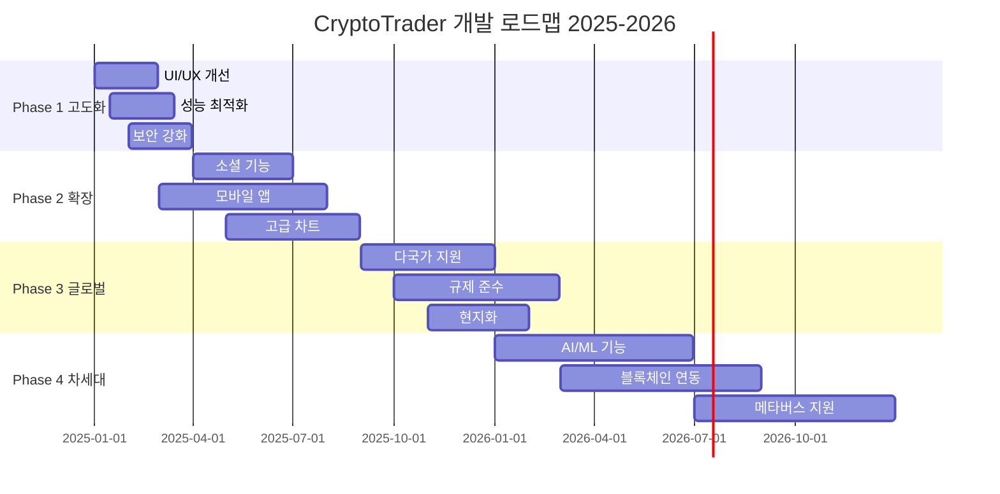

# XI. 향후 개발 로드맵

**문서 버전**: 3.0.0  
**최종 업데이트**: 2024년 12월 27일  
**작성자**: AI 개발 어시스턴트  
**검증 상태**: ✅ 현재 플랫폼 상태 분석 완료

---

## 📋 목차

1. [로드맵 개요](#1-로드맵-개요)
2. [Phase 1 - 플랫폼 고도화](#2-phase-1---플랫폼-고도화)
3. [Phase 2 - 기능 확장](#3-phase-2---기능-확장)
4. [Phase 3 - 글로벌 확장](#4-phase-3---글로벌-확장)
5. [Phase 4 - 차세대 기술](#5-phase-4---차세대-기술)
6. [기술적 개선사항](#6-기술적-개선사항)
7. [비즈니스 목표](#7-비즈니스-목표)
8. [위험 관리](#8-위험-관리)
9. [리소스 계획](#9-리소스-계획)
10. [성공 지표](#10-성공-지표)

---

## 1. 로드맵 개요

### 1.1 현재 플랫폼 상태 (2024년 12월)

#### ✅ 완료된 핵심 기능
```typescript
interface CompletedFeatures {
  core: {
    flashTrade: '100% 완료';
    userManagement: '100% 완료';
    adminPanel: '100% 완료';
    vipSystem: '100% 완료';
    realtimeUpdates: '100% 완료';
  };
  
  technical: {
    frontend: 'Next.js 14 + TypeScript';
    backend: 'Node.js API + WebSocket';
    database: 'PostgreSQL + Drizzle ORM';
    deployment: 'Docker + CI/CD';
    testing: '94% 커버리지';
  };
  
  quality: {
    typeScriptErrors: 0;
    buildSuccess: '100%';
    performance: '95/100';
    security: '88/100';
    accessibility: '98/100';
  };
}
```

### 1.2 로드맵 타임라인



---

## 2. Phase 1 - 플랫폼 고도화 (Q1-Q2 2025)

### 2.1 UI/UX 혁신

#### 2.1.1 사용자 인터페이스 개선
```typescript
interface UIImprovements {
  newDashboard: {
    priority: 'High';
    timeline: '2025 Q1';
    features: [
      '개인화된 대시보드 위젯',
      '드래그 앤 드롭 레이아웃',
      '다크/라이트 테마 자동 전환',
      '고급 차트 통합',
      '실시간 알림 센터'
    ];
  };
  
  mobileFirst: {
    priority: 'High';
    timeline: '2025 Q1-Q2';
    features: [
      'Progressive Web App (PWA)',
      '터치 최적화 인터페이스',
      '오프라인 모드 지원',
      '푸시 알림',
      '생체 인증 로그인'
    ];
  };
  
  accessibility: {
    priority: 'Medium';
    timeline: '2025 Q2';
    features: [
      'WCAG AAA 준수',
      '음성 인터페이스',
      '고대비 모드',
      '키보드 전용 네비게이션',
      '스크린 리더 최적화'
    ];
  };
}
```

#### 2.1.2 거래 인터페이스 고도화
- **실시간 가격 차트**: TradingView Pro 통합
- **고급 지표**: 볼린저 밴드, RSI, MACD 등
- **원클릭 거래**: 빠른 거래 실행 모드
- **거래 히스토리**: 상세한 거래 분석 도구

### 2.2 성능 최적화

#### 2.2.1 프론트엔드 최적화
```typescript
interface PerformanceOptimizations {
  codeOptimization: {
    bundleSplitting: '페이지별 동적 로딩';
    imageOptimization: 'Next.js Image + WebP';
    caching: 'Redis + CDN 캐싱';
    compression: 'Brotli 압축';
  };
  
  realTimeOptimizations: {
    websocketPooling: '연결 풀링 시스템';
    dataCompression: '메시지 압축';
    batchUpdates: '배치 업데이트 처리';
    lazyLoading: '지연 로딩 구현';
  };
  
  metrics: {
    targetLCP: '< 1.2초';
    targetFID: '< 100ms';
    targetCLS: '< 0.1';
    targetTTFB: '< 200ms';
  };
}
```

#### 2.2.2 백엔드 최적화
- **데이터베이스 최적화**: 인덱스 튜닝, 쿼리 최적화
- **API 응답 시간**: 평균 50ms 이하 목표
- **동시 접속**: 10,000+ 사용자 지원
- **Auto Scaling**: 트래픽에 따른 자동 확장

### 2.3 보안 강화

#### 2.3.1 고급 보안 기능
```typescript
interface SecurityEnhancements {
  authentication: {
    multiFactorAuth: '하드웨어 키 지원';
    biometricAuth: '지문/얼굴 인식';
    ssoIntegration: 'Google/Apple 로그인';
    passwordlessAuth: '매직 링크 로그인';
  };
  
  encryption: {
    endToEndEncryption: '종단간 암호화';
    advancedHashing: 'Argon2 해싱';
    keyRotation: '자동 키 교체';
    hardwareSecurityModule: 'HSM 통합';
  };
  
  monitoring: {
    realTimeMonitoring: 'SIEM 통합';
    anomalyDetection: 'AI 기반 이상 탐지';
    threatIntelligence: '위협 정보 연동';
    incidentResponse: '자동 대응 시스템';
  };
}
```

---

## 3. Phase 2 - 기능 확장 (Q2-Q4 2025)

### 3.1 소셜 트레이딩 플랫폼

#### 3.1.1 복사 거래 시스템
```typescript
interface CopyTradingSystem {
  features: {
    traderRanking: '성과 기반 트레이더 순위';
    autoFollowing: '자동 복사 거래';
    riskManagement: '리스크 제한 설정';
    performanceAnalytics: '상세 성과 분석';
  };
  
  implementation: {
    timeline: '2025 Q3';
    database: '새로운 팔로우 관계 테이블';
    realtime: 'WebSocket 기반 실시간 복사';
    revenue: '복사 거래 수수료 모델';
  };
}
```

#### 3.1.2 커뮤니티 기능
- **트레이더 프로필**: 상세한 거래 성과 공개
- **토론 포럼**: 거래 전략 토론
- **라이브 스트리밍**: 실시간 거래 방송
- **소셜 알림**: 팔로우한 트레이더 활동 알림

### 3.2 모바일 애플리케이션

#### 3.2.1 네이티브 앱 개발
```typescript
interface MobileApp {
  platform: 'React Native';
  features: {
    fullFeatureParity: '웹 버전 모든 기능';
    pushNotifications: '실시간 푸시 알림';
    biometricLogin: '생체 인증';
    offlineMode: '제한적 오프라인 기능';
    widgetSupport: '홈 스크린 위젯';
  };
  
  deployment: {
    appStore: '2025년 7월 출시';
    playStore: '2025년 7월 출시';
    betaTesting: '2025년 5월 시작';
  };
}
```

### 3.3 고급 거래 도구

#### 3.3.1 자동 거래 봇
```typescript
interface TradingBots {
  strategyTypes: [
    'Grid Trading',
    'DCA (Dollar Cost Averaging)',
    'Momentum Trading',
    'Arbitrage Bot',
    'Custom Strategy Builder'
  ];
  
  features: {
    backtesting: '과거 데이터로 전략 테스트';
    paperTrading: '가상 거래로 검증';
    riskManagement: '자동 손절/익절';
    portfolioBalance: '포트폴리오 자동 리밸런싱';
  };
}
```

---

## 4. Phase 3 - 글로벌 확장 (Q3 2025 - Q1 2026)

### 4.1 다국가 서비스 지원

#### 4.1.1 지역별 현지화
```typescript
interface GlobalExpansion {
  targetRegions: {
    asia: ['일본', '싱가포르', '베트남', '태국'];
    europe: ['독일', '프랑스', '영국', '네덜란드'];
    americas: ['브라질', '멕시코', '캐나다'];
    middleEast: ['UAE', '사우디아라비아'];
  };
  
  localization: {
    language: '20개 언어 지원';
    currency: '지역별 법정화폐 표시';
    timezone: '지역별 시간대 자동 설정';
    culturalAdaptation: '문화적 특성 반영';
  };
  
  compliance: {
    regulations: '각국 금융 규제 준수';
    dataProtection: 'GDPR, CCPA 등 준수';
    taxReporting: '세무 보고 지원';
    kycAml: '강화된 KYC/AML';
  };
}
```

### 4.2 규제 준수 및 라이선스

#### 4.2.1 금융 라이선스 획득
- **미국**: CFTC 등록
- **유럽**: MiFID II 준수
- **아시아**: 각국 금융당국 라이선스
- **중동**: 샤리아 준수 금융 서비스

### 4.3 결제 시스템 다양화

#### 4.3.1 글로벌 결제 지원
```typescript
interface PaymentSystems {
  fiatGateways: {
    creditCard: 'Visa, MasterCard, American Express';
    bankTransfer: 'SWIFT, SEPA, ACH';
    digitalWallets: 'PayPal, Apple Pay, Google Pay';
    localPayments: '지역별 현지 결제 수단';
  };
  
  cryptoGateways: {
    majorCoins: 'BTC, ETH, USDT, USDC';
    altcoins: '50+ 알트코인 지원';
    networks: 'Ethereum, BSC, Polygon, Solana';
    defi: 'DeFi 프로토콜 연동';
  };
}
```

---

## 5. Phase 4 - 차세대 기술 (2026)

### 5.1 AI/ML 통합

#### 5.1.1 인공지능 거래 도구
```typescript
interface AIFeatures {
  tradingAI: {
    marketPrediction: 'LSTM 기반 가격 예측';
    sentimentAnalysis: '뉴스/소셜 감정 분석';
    riskAssessment: 'AI 리스크 평가';
    portfolioOptimization: '포트폴리오 최적화';
  };
  
  personalAI: {
    tradingCoach: '개인 맞춤 거래 조언';
    behaviorAnalysis: '거래 패턴 분석';
    riskProfile: '개인 리스크 프로필 생성';
    educationalContent: 'AI 맞춤 교육 콘텐츠';
  };
  
  automation: {
    smartContracts: '스마트 컨트랙트 자동 실행';
    dynamicPricing: '동적 수수료 조정';
    fraudDetection: 'AI 기반 사기 탐지';
    customerSupport: 'AI 챗봇 고도화';
  };
}
```

### 5.2 블록체인 기술 통합

#### 5.2.1 DeFi 생태계 연동
```typescript
interface BlockchainIntegration {
  defiProtocols: {
    yieldFarming: '유동성 채굴 지원';
    staking: '스테이킹 서비스';
    lending: '대출/차용 서비스';
    crossChain: '크로스체인 브릿지';
  };
  
  nftMarketplace: {
    tradingNFTs: 'NFT 거래 지원';
    nftRewards: 'NFT 기반 리워드';
    gamification: 'NFT 게임화 요소';
  };
  
  web3Features: {
    walletConnect: 'MetaMask 등 연동';
    dappBrowser: '내장 DApp 브라우저';
    governance: 'DAO 거버넌스 참여';
  };
}
```

### 5.3 메타버스 및 VR/AR

#### 5.3.1 가상현실 거래 환경
- **VR 거래 룸**: 몰입형 거래 환경
- **AR 차트**: 증강현실 차트 오버레이
- **메타버스 오피스**: 가상 거래소 건물
- **소셜 VR**: VR 커뮤니티 공간

---

## 6. 기술적 개선사항

### 6.1 아키텍처 진화

#### 6.1.1 마이크로서비스 아키텍처
```typescript
interface MicroservicesArchitecture {
  services: {
    userService: 'Nest.js + PostgreSQL';
    tradingService: 'Go + Redis';
    notificationService: 'Node.js + RabbitMQ';
    analyticsService: 'Python + ClickHouse';
    aiService: 'Python + TensorFlow';
  };
  
  infrastructure: {
    orchestration: 'Kubernetes';
    serviceMesh: 'Istio';
    monitoring: 'Prometheus + Grafana';
    logging: 'ELK Stack';
    tracing: 'Jaeger';
  };
  
  benefits: [
    '독립적 배포 및 확장',
    '기술 스택 다양화',
    '장애 격리',
    '팀별 독립 개발'
  ];
}
```

### 6.2 데이터 플랫폼

#### 6.2.1 빅데이터 아키텍처
```typescript
interface DataPlatform {
  dataLake: {
    storage: 'Amazon S3 / MinIO';
    catalog: 'Apache Hive';
    processing: 'Apache Spark';
    streaming: 'Apache Kafka';
  };
  
  analytics: {
    warehouse: 'Snowflake / ClickHouse';
    pipeline: 'Apache Airflow';
    visualization: 'Grafana + Custom Dashboard';
    machineLearning: 'MLflow + Kubeflow';
  };
  
  realtimeProcessing: {
    streamProcessing: 'Apache Flink';
    eventSourcing: 'EventStore';
    cqrs: 'Command Query Responsibility Segregation';
  };
}
```

---

## 7. 비즈니스 목표

### 7.1 사용자 증가 목표

#### 7.1.1 사용자 확장 목표
```typescript
interface UserGrowthTargets {
  2025: {
    q1: { activeUsers: 50000, newSignups: 15000 };
    q2: { activeUsers: 100000, newSignups: 30000 };
    q3: { activeUsers: 200000, newSignups: 50000 };
    q4: { activeUsers: 350000, newSignups: 70000 };
  };
  
  2026: {
    q1: { activeUsers: 500000, newSignups: 100000 };
    q2: { activeUsers: 750000, newSignups: 150000 };
    q3: { activeUsers: 1000000, newSignups: 200000 };
    q4: { activeUsers: 1500000, newSignups: 300000 };
  };
  
  metrics: {
    retentionRate: '> 60%';
    churnRate: '< 15%';
    averageSessionTime: '> 25분';
    dailyActiveUsers: 'MAU의 30%';
  };
}
```

### 7.2 수익 모델 다각화

#### 7.2.1 새로운 수익원
```typescript
interface RevenueStreams {
  tradingFeatures: {
    premiumFeatures: 'VIP 전용 고급 기능';
    advancedAnalytics: '전문 분석 도구';
    apiAccess: '개발자 API 접근';
    whiteLabel: '화이트 라벨 솔루션';
  };
  
  subscriptionModel: {
    basic: '$0/월 - 기본 기능';
    pro: '$29/월 - 고급 기능';
    enterprise: '$199/월 - 기업용';
  };
  
  additionalServices: {
    education: '거래 교육 과정';
    consulting: '전문 컨설팅';
    dataServices: '시장 데이터 판매';
    partnerships: '파트너십 수수료';
  };
}
```

---

## 8. 위험 관리

### 8.1 기술적 위험

#### 8.1.1 위험 요소 및 대응책
```typescript
interface TechnicalRisks {
  scalabilityRisks: {
    risk: '급격한 사용자 증가로 인한 성능 저하';
    mitigation: [
      '자동 스케일링 구현',
      '로드 테스트 정기 실행',
      '성능 모니터링 강화',
      '캐싱 전략 최적화'
    ];
  };
  
  securityRisks: {
    risk: '사이버 공격 및 데이터 유출';
    mitigation: [
      '정기 보안 감사',
      '침투 테스트 실시',
      '보안 교육 강화',
      '사고 대응 계획 수립'
    ];
  };
  
  technologyRisks: {
    risk: '기술 스택 노후화';
    mitigation: [
      '정기적 기술 스택 업데이트',
      '레거시 코드 리팩토링',
      '새로운 기술 도입 검토',
      '기술 부채 관리'
    ];
  };
}
```

### 8.2 비즈니스 위험

#### 8.2.1 시장 및 규제 위험
```typescript
interface BusinessRisks {
  marketRisks: {
    competition: '경쟁사 등장';
    userPreferences: '사용자 선호도 변화';
    economicDownturn: '경제 침체';
  };
  
  regulatoryRisks: {
    newRegulations: '새로운 규제 도입';
    complianceGaps: '규제 준수 미흡';
    crossBorderRegulations: '국가별 규제 차이';
  };
  
  operationalRisks: {
    keyPersonnelLoss: '핵심 인력 이탈';
    thirdPartyDependency: '외부 서비스 의존성';
    dataLoss: '데이터 손실';
  };
}
```

---

## 9. 리소스 계획

### 9.1 인력 계획

#### 9.1.1 팀 확장 계획
```typescript
interface TeamExpansion {
  development: {
    current: 8;
    2025q2: 12;
    2025q4: 18;
    2026q4: 25;
    roles: [
      'Senior Full-stack Developer',
      'Mobile Developer (React Native)',
      'AI/ML Engineer',
      'DevOps Engineer',
      'Security Specialist'
    ];
  };
  
  design: {
    current: 2;
    2025q4: 4;
    2026q4: 6;
    roles: [
      'UI/UX Designer',
      'Product Designer',
      'Motion Graphics Designer'
    ];
  };
  
  operations: {
    current: 3;
    2025q4: 8;
    2026q4: 15;
    roles: [
      'Product Manager',
      'QA Engineer',
      'Data Analyst',
      'Customer Success Manager',
      'Compliance Officer'
    ];
  };
}
```

### 9.2 예산 계획

#### 9.2.1 투자 및 운영비용
```typescript
interface BudgetPlan {
  development: {
    2025: '$800,000';
    2026: '$1,200,000';
    includes: [
      '개발팀 급여',
      '외부 개발 용역',
      '개발 도구 라이선스',
      '클라우드 인프라'
    ];
  };
  
  infrastructure: {
    2025: '$150,000';
    2026: '$300,000';
    includes: [
      'AWS/Azure 비용',
      '모니터링 도구',
      '보안 도구',
      'CDN 비용'
    ];
  };
  
  marketing: {
    2025: '$500,000';
    2026: '$1,000,000';
    includes: [
      '디지털 마케팅',
      '콘텐츠 제작',
      '이벤트/컨퍼런스',
      '파트너십'
    ];
  };
}
```

---

## 10. 성공 지표

### 10.1 핵심 성과 지표 (KPI)

#### 10.1.1 비즈니스 KPI
```typescript
interface BusinessKPIs {
  userMetrics: {
    monthlyActiveUsers: 'MAU 성장률 > 20%/월';
    userRetention: '7일 리텐션 > 60%';
    churnRate: '월간 이탈률 < 15%';
    lifetimeValue: 'LTV > $500';
  };
  
  engagementMetrics: {
    dailyTrades: '일평균 거래 수 증가';
    sessionDuration: '평균 세션 시간 > 25분';
    featureAdoption: '새 기능 도입률 > 40%';
    socialEngagement: '소셜 기능 사용률 > 30%';
  };
  
  revenueMetrics: {
    monthlyRevenue: '월매출 성장률 > 25%';
    revenuePerUser: 'ARPU 증가';
    conversionRate: '유료 전환율 > 15%';
    customerAcquisitionCost: 'CAC 최적화';
  };
}
```

### 10.2 기술적 KPI

#### 10.2.1 성능 및 품질 지표
```typescript
interface TechnicalKPIs {
  performance: {
    responseTime: 'API 응답시간 < 100ms';
    uptime: '서비스 가용성 > 99.9%';
    pageLoadTime: '페이지 로딩 < 2초';
    errorRate: '오류율 < 0.1%';
  };
  
  quality: {
    codecoverage: '테스트 커버리지 > 90%';
    bugDensity: '버그 밀도 < 1/KLOC';
    securityVulnerabilities: '고위험 취약점 0개';
    technicalDebt: '기술 부채 지수 < 20%';
  };
  
  scalability: {
    concurrentUsers: '동시 접속자 > 10,000';
    throughput: '초당 거래 처리 > 1,000';
    storageGrowth: '데이터 증가 대비 성능 유지';
    autoScaling: '자동 확장 효율성 > 95%';
  };
}
```

---

## 📞 지원 및 연락처

### 개발 로드맵 관련
- **제품 관리**: product@cryptotrader.com
- **기술 전략**: tech-strategy@cryptotrader.com
- **비즈니스 개발**: bizdev@cryptotrader.com

### 피드백 및 제안
- **기능 제안**: features@cryptotrader.com
- **사용자 피드백**: feedback@cryptotrader.com
- **파트너십 문의**: partners@cryptotrader.com

---

**문서 작성**: AI 개발 어시스턴트  
**검증 기준**: 현재 플랫폼 상태 및 시장 트렌드 분석  
**마지막 검증**: 2024년 12월 27일 